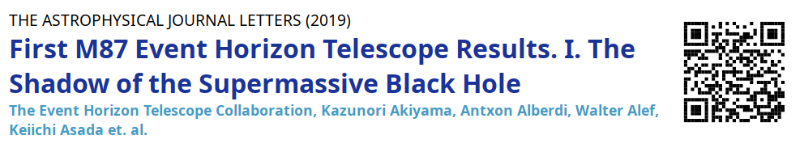
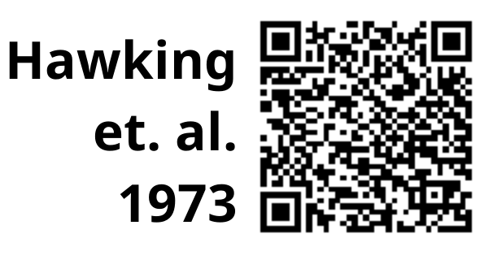
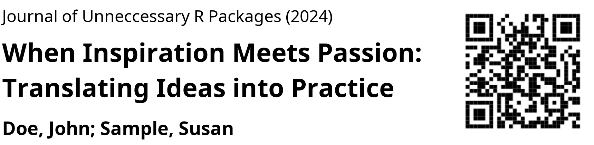
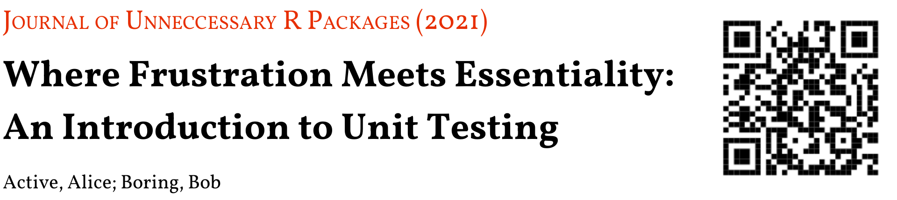
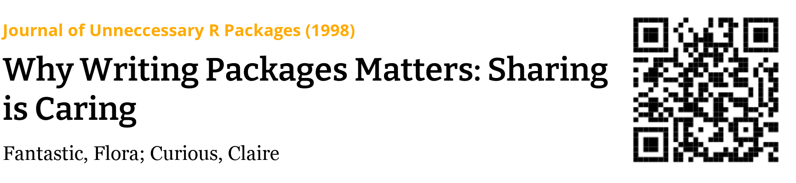

<!-- README.md is generated from README.Rmd. Please edit that file -->

# namedropR 

<!-- badges: start -->

[](https://CRAN.R-project.org/package=namedropR)
[](https://github.com/nucleic-acid/namedropR/actions)
[](https://CRAN.R-project.org/package=namedropR)

<!-- badges: end -->

`namedropR` provides ‘visual citations’ containing the metadata of a
scientific paper and a ‘QR’ code.

## Installation

To install, simply run:

``` r
install.packages("namedropR")
```

You can install the development version of namedropR from
[GitHub](https://github.com/) with:

``` r
# install.packages("devtools")
devtools::install_github("nucleic-acid/namedropR")
```

## Visual Citations

A ‘visual citation’ is a banner containing an article’s title, authors,
journal and year of a publication (s. example below).



One might want to include this in a presentation

-   to back up one’s claims,
-   to drop an important name,
-   to boast about a publication in a ‘high impact journal’.

*Some might even use this to genuinely **point the audience to good
resources** for further reading.*

On conferences, such banners are frequently displayed way too short for
the audience to actually comprehend them (and often in a bad
resolution). Creating visual citations requires manually taking a
screenshot and placing it on the slide.



`namedropR` helps to generate visual citations conveniently (see below),
in high resolution and with a QR code. This allows the audience to
follow the reference *while you are talking about it*, instead of
looking it up in a reference list at the end of your talk.  
There is also a less intrusive, compact style, as seen on the left.

## Basic Usage

This package accepts bibliographic information as ‘BibTeX’ and
‘BibLaTeX’ references and includes a QR code pointing to the
[‘DOI’](https://www.doi.org). If the ‘DOI’ is not available in the
bibliography entry, but a ‘URL’ field instead, this is used. If neither
is given, the QR code points to a search call at
<https://scholar.google.com> with the available data as search terms.

``` r
bib_path <- "path/to/bibliography_file.bib"

# load the package
library('namedropR')

drop_name(bib_path, cite_key = "SomeAuthor2010")
```

`drop_name()` by default returns the file path, where the visual
citation was stored as character string. Within an Rmarkdown/HTML
presentation you can render the VC and directly pass the path to
`{htmltools}` to include the banner:

``` r
# PNG
htmltools::img(
  src = drop_name(
    bib_path,
    cite_key = "SomeAuthor2010",
    export_as = "png"
  )
)

# HTML (note the recommended option use_xaringan, see documentation for details)
htmltools::includeHTML(
  drop_name(
    bib_path,
    cite_key = "SomeAuthor2010",
    export_as = "html",
    use_xaringan = TRUE
  )
)
```

To **bulk-create** VCs to include in another kind of document /
presentation slides you can pass a vector of citation keys or pass no
keys at all to render some or all bibliography entries respectively:

``` r
drop_name(
  bib_path,
  cite_key = c("SomeAuthor2010", "SomeOther2011", "YetAnother2012"),
  export_as = "png",
  style = "clean"
)
#> renders the three specified banners

drop_name(
  bib_path,
  export_as = "png",
  style = "clean"
)
#> renders all entries within the specified bibliography file
```

## Options

It is possible to specify output format (HTML or PNG), style, size of
the QR code and much more. See the vignettes for all options.

These are some frequently used options:

``` r
# create a visual citation as PNG with 'modern' design
drop_name(bib_path, cite_key = "SomeAuthor2010", export_as = "png", style = "modern")

# create a visual citation as HTML with 'compact' design
drop_name(bib_path, cite_key = "SomeAuthor2010", export_as = "html", style = "compact")

# set a smaller QR code size, default is 250 (pixels)
drop_name(bib_path, cite_key = "SomeAuthor2010", export_as = "png", qr_size = 150)

# set a wider text area for long titles or long author lists, default is 600 (pixels)
drop_name(bib_path, cite_key = "SomeAuthor2010", export_as = "png", vc_width = 800)
```

## Styles

These are the currently predefined styles:

| Name      | Example                                                                                                                                                                                                       |
|-----------|---------------------------------------------------------------------------------------------------------------------------------------------------------------------------------------------------------------|
| modern    |     |
| modern_bw |  |
| classic   |    |
| fancy     |      |
| clean     |      |
| newspaper |  |
| compact   |     |

Styling is possible via these predefined designs or via custom ‘CSS’
e.g. to match the design of the HTML presentation like e.g. ‘xaringan’
or ‘revealJS’ (see the vignette for more options).

## How to contribute

If you have ideas for Visual Citation styles and think, everyone should
be able to use them, feel free to [open an
issue](https://github.com/nucleic-acid/namedropR/issues) and describe
the style or provide the CSS code, if you have one already.

If you want to speed things up, you can fork the project to create a
pull request. Please also open an issue, so we can have a discussion, if
needed. See the
[readme](https://github.com/nucleic-acid/namedropR/blob/main/inst/styles/readme.md)
for details.

## Code of Conduct

Please note that the namedropR project is released with a [Contributor
Code of
Conduct](https://contributor-covenant.org/version/2/0/CODE_OF_CONDUCT.html).
By contributing to this project, you agree to abide by its terms.

## Notes

-   This package is not intended as replacement for proper reference
    manager packages, but a tool to enrich scientific presentation
    slides. Hence the functionality is quite limited to this specific
    use case.
-   previous versions (before v2.0) allowed passing
    `RefManageR::BibEntry()` objects. This option was removed to
    eliminate dependency on the orphaned `{bibtex}` package. This might
    break code for users of initial releases of the package, but was
    needed to allow for CRAN submission.
